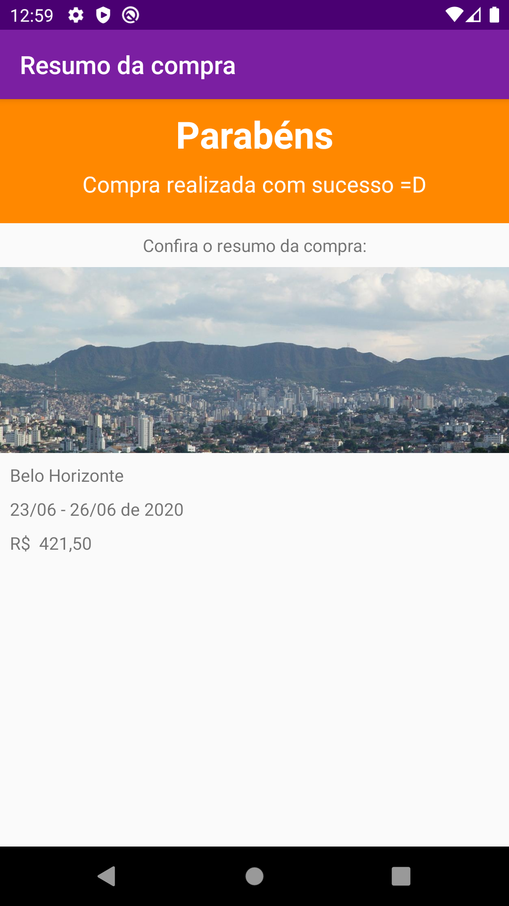

# android-travel
Project that uses android about travels
<table>
  <tr>
    <th>Home</th>
    <th>Description</th>
    <th>Purchase Screen</th>
  </tr>
  <tr>
    <td> </td>
    <td></td>
    <td></td>
  </tr>
</table>

<table>
  <tr>
    <th>Finish Success Message Feedback</th>
  </tr>
  <tr>
    <td> </td>
  </tr>
</table>
